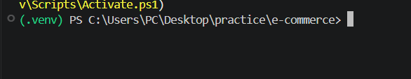

# Flask  Based - E commerce Project 

This is a simple python-flask based app which perform basic CRUD applications like `GET` , `POST` ,`PUT` ,`DELETE` , good for understanding and to get  familiar with the http methods.

## Features
- Create shops
- Get all shops or a single shop
- Update shop details
- Delete shops
- Create products linked to shops
- Get all products or a single product
- Update product details
- Delete products

## Technology Used
- Python
- Flask
- `UUID` Module

## How to use ?
 - ### Create Virtual Environment
1. #### Open VS Code and open terminal , and type the following command 

### Windows

<pre>> mkdir myproject
> cd myproject
> py -3 -m venv .venv</pre>

### Linux/macOS

<pre>$ mkdir myproject
$ cd myproject
$ python 3 -m venv .venv</pre>

2. #### After that you would see venv folder in your working directory , to activate environment use 

### Windows

<pre>> .venv\Scripts\activate</pre>

### Linux/macOS

<pre>$ . .venv/bin/activate</pre>

3. #### You would see `(venv)` written in terminal that means its activated successfully.

4. #### Now we have to install dependencies , which can be done by using requirment.txt file using following command  .
<pre>> pip install -r requirements.txt</pre>
5. #### Now we are ready to test , you can test the program using a API testing tool like Postman .

