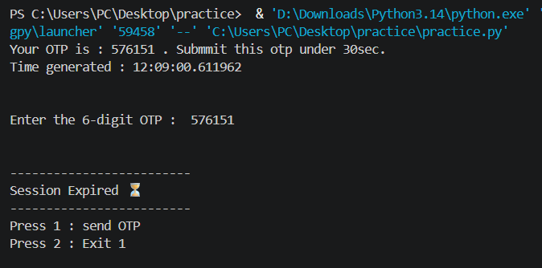
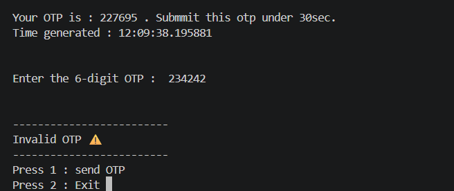
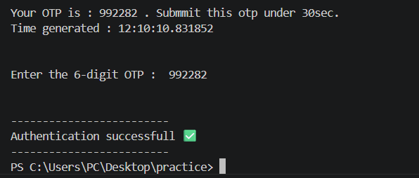

# OTP Generator Program 🔒
A simple Python program to generate a One-Time Password (OTP) and validate it within a limited time.

## Features
- Generate a 6-digit OTP
- Record the time when OTP is generated
- User have to give OTP under limited time
- Validate the OTP according to time limit

## Technologies Used
- Python
- `Random` module 
- `Datetime`module

## Example

### Session expired

### Authentication failed

### Authentication Successfull

## Future enhancements
- Limiting number of OTP attempts per day.
